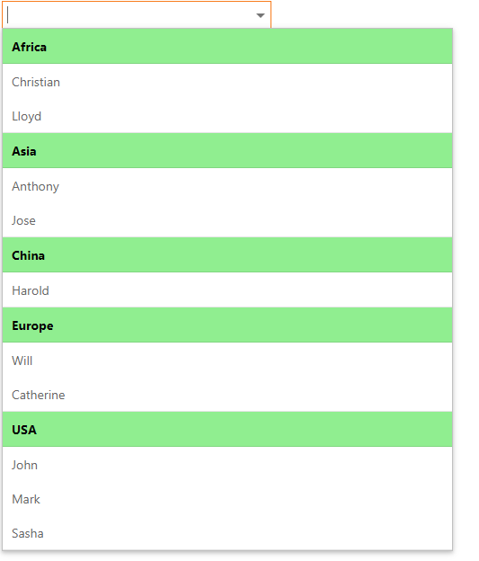

<!-- default badges list -->

[](https://supportcenter.devexpress.com/ticket/details/T1064526)
[](https://docs.devexpress.com/GeneralInformation/403183)
<!-- default badges end -->

# Grid Lookup for ASP.NET Web Forms - How to create a dropdown with grouped items
<!-- run online -->
**[[Run Online]](https://codecentral.devexpress.com/454625952/)**
<!-- run online end -->

The example demonstrates how to create a dropdown with grouped items. 



## Implementation Details

In this example, the client [ASPxClientGridLookup.KeyPress](https://docs.devexpress.com/AspNet/js-ASPxClientTextEdit.KeyPress) event is handled to implement incremental filtering. The event handler uses the nested grid's [ApplySearchPanelFilter](https://docs.devexpress.com/AspNet/js-ASPxClientGridView.ApplySearchPanelFilter(value)) method to filter data columns. 

To prevent multiple callback requests when keys are pressed in succession, `setTimeout` and `clearTimeout` methods are used. 

The Enter key and Arrow keys send a callback request when they are pressed in the `KeyPress` event. Call the [ASPxClientUtils.GetKeyCode](https://docs.devexpress.com/AspNet/js-ASPxClientUtils.GetKeyCode.static(htmlEvent)) method to get the key that was pressed and prevent filtering when these keys are pressed to avoid sending callback requests.


```jscript
var timeout = 0;
function OnKeyPress(s, e) {
    var keyCode = ASPxClientUtils.GetKeyCode(e.htmlEvent);
    if (keyCode == 13)
        return;
    s.ShowDropDown();
    if (timeout) {
        clearTimeout(timeout);
    }
    timeout = setTimeout(function () {
        var filter = s.GetInputElement().value;
        if (keyCode == 37 || keyCode == 38 || keyCode == 39 || keyCode == 40) {
            return;
        }
        s.GetGridView().ApplySearchPanelFilter(filter)
    }, 500);
}
```

Apply custom CSS classes to make the grid look like a standard dropdown.

Single column implementation:

```cs
.groupRow {
    font-weight: bold;
    color: black;
    background-color: lightgreen;
}

.dataRow td.dxgvIndentCell {
    display: none;
}
```

Multi-column implementation:

```cs
.groupRow {
   font-weight: bold;
    color: black;
    background-color: lightgreen;
}
```

## Files to Review

* [SingleColumn.aspx](./CS/DXWebApplication1/SingleColumn.aspx) (VB: [SingleColumn.aspx](./VB/DXWebApplication1/SingleColumn.aspx))
* [SingleColumn.cs](./CS/DXWebApplication1/SingleColumn.aspx.cs) (VB: [SingleColumn.vb](./VB/DXWebApplication1/SingleColumn.aspx.vb))
* [MultiColumn.aspx](./CS/DXWebApplication1/MultiColumn.aspx) (VB: [MultiColumn.aspx](./VB/DXWebApplication1/MultiColumn.aspx))
* [MultiColumn.cs](./CS/DXWebApplication1/MultiColumn.aspx.cs) (VB: [MultiColumn.vb](./VB/DXWebApplication1/MultiColumn.aspx.vb))
